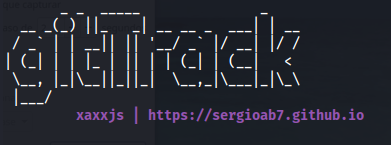
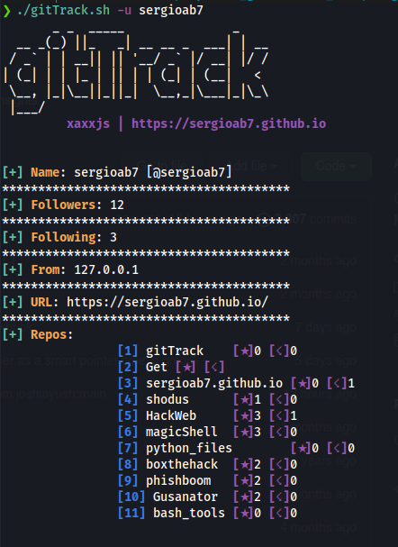

</p>


<h1>gitTrack</h1>

gitTrack allows you to search for information from any github user!

## :shipit: Uso

```
git clone https://github.com/sergioab7/gitTrack.git
cd gitTrack/
chmod +x gitTrack.sh
./gitTrack.sh
```
## :small_orange_diamond: Resultados

<p align="center">

</p>


